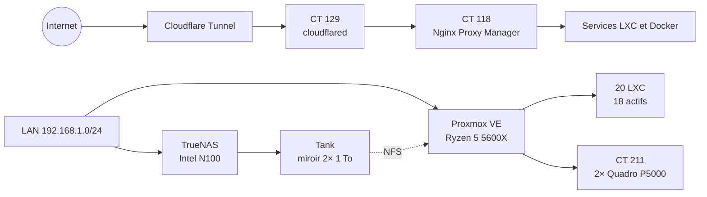

# ZorkoLab

> Homelab self-hosted autour de Proxmox, TrueNAS, Cloudflare et de l'inférence LLM locale.

Ce dépôt décrit l'infrastructure telle qu'elle fonctionne réellement. Les chiffres ci-dessous viennent d'un audit direct de Proxmox, des conteneurs, de Nginx Proxy Manager et de TrueNAS réalisé le **10 septembre 2026**.

## Vue d'ensemble

| Brique | État audité |
|:---|:---|
| Compute | Ryzen 5 5600X, 32 GiB de RAM, Proxmox VE 9.2.11 |
| Accélération | 2× Quadro P5000 16 GiB affectées au LXC 211 |
| Virtualisation | 20 LXC, dont 18 actifs, plus un template VM arrêté |
| Exposition web | 19 hôtes proxy actifs sur 24 configurés dans NPM |
| Stockage | miroir ZFS de 920 GiB utilisables, 34,9 % occupés, aucune erreur |
| Réseau | LAN unique `192.168.1.0/24`, passerelle `192.168.1.254` |
| Défense hôte | pare-feu Proxmox, CrowdSec et Fail2Ban actifs |
| Supervision | audit quotidien à 06:00 et heartbeat hebdomadaire via ntfy |

## Services

| Domaine | Services principaux |
|:---|:---|
| Edge et réseau | cloudflared, Nginx Proxy Manager, AdGuard Home |
| Développement | Gitea, Codeman, Portfolio, Docker/Portainer |
| Média | qBittorrent + Gluetun, Sonarr, Radarr, Bazarr, Prowlarr, Seerr, Shelfmark |
| Maison | Homebridge |
| IA | llama.cpp sur 2× P5000, LLM Gateway, Jarvis 2 / Hermes |
| Sécurité et suivi | Vaultwarden, Beszel, CrowdSec, Fail2Ban, ntfy |
| Données | AzerothDB, Umami, SearXNG, Veille Sociale |

L'inventaire détaillé, avec IDs, ressources et états, se trouve dans [architecture/virtualization.md](./architecture/virtualization.md).

## État opérationnel au 10 septembre 2026

Le calcul, le réseau, le tunnel Cloudflare et le pool ZFS sont opérationnels. L'audit a toutefois relevé des points à traiter :

- le pool LVM-thin Proxmox est occupé à 82,5 % et bloque certains snapshots de sauvegarde ;
- les jobs de sauvegarde des 9 et 10 septembre se sont terminés avec des erreurs ;
- les LXC 203, 210 et 211 ne figurent pas encore dans le job VZDump ;
- la tâche de snapshots TrueNAS du dataset `backup` est désactivée ;
- 14 mises à jour de sécurité Debian sont en attente sur l'hôte ;
- `nvidia-persistenced.service` est en échec, même si les deux GPU et llama.cpp fonctionnent ;
- d'anciennes règles pare-feu visant `10.10.0.0/16` subsistent alors que les VLAN ne sont plus déployés.

Le détail, les preuves vérifiées et les limites de l'inspection sont consignés dans [AUDIT-2026-09-10.md](./AUDIT-2026-09-10.md).

## Documentation

| Sujet | Document |
|:---|:---|
| Topologie réseau | [architecture/network.md](./architecture/network.md) |
| Conteneurs et virtualisation | [architecture/virtualization.md](./architecture/virtualization.md) |
| Stockage et datasets | [architecture/storage.md](./architecture/storage.md) |
| Nœud de calcul | [hardware/compute.md](./hardware/compute.md) |
| Nœud TrueNAS | [hardware/storage.md](./hardware/storage.md) |
| Matériel réseau | [hardware/network.md](./hardware/network.md) |
| Contrôle d'accès | [security/access_control.md](./security/access_control.md) |
| Cloudflare et reverse proxy | [security/cloudflare_zero_trust.md](./security/cloudflare_zero_trust.md) |
| Sauvegardes et contrôles | [automation/backups.md](./automation/backups.md) |

## Portée

Ce dépôt est une documentation d'exploitation, pas une promesse de haute disponibilité. Le miroir ZFS protège contre la panne d'un disque, mais ne remplace pas une sauvegarde hors site. Les états et taux d'occupation sont des instantanés datés et évolueront avec le lab.
