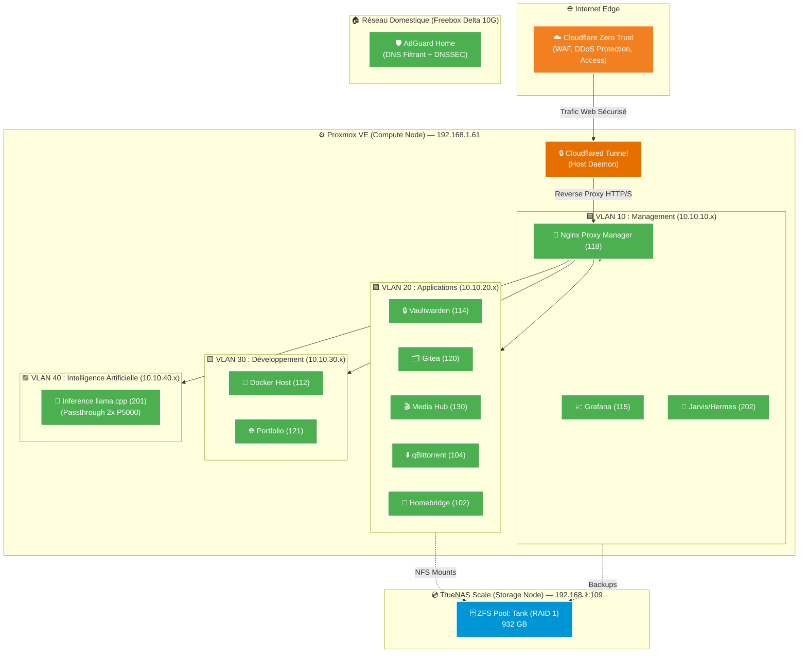

# 🏠 ZorkoLab : Infrastructure & Homelab

> Architecture d'hébergement privé haute performance, orientée sécurité (Zero-Trust), virtualisation et intelligence artificielle.

---

## 🏗️ Architecture du Système

L'infrastructure est bâtie sur un modèle hyper-convergé séparant logiquement le stockage (TrueNAS) du calcul (Proxmox), tout en assurant une isolation stricte des services via des VLANs.

---

## 📊 État de l'Infrastructure

| Catégorie | Détail | Statut / Métrique |
|:---|:---|:---|
| **Réseau** | Freebox Delta (FTTH) | **10 Gbps ↓** / **900 Mbps ↑** |
| **Sécurité** | CrowdSec, Proxmox Firewall, AdGuard | **Actifs & Durcis** |
| **Compute** | AMD Ryzen 5 5600X (6C/12T) / 32 GB RAM | ~20% d'utilisation RAM |
| **GPU** | 2× NVIDIA Quadro P5000 (16 GB) | Allouées à l'IA (LXC 201) |
| **Containers** | 12 LXC "Unprivileged" | Production 24/7 |
| **Stockage** | ZFS Miroir (TrueNAS) | **661 GB** / 932 GB (70.9% utilisés) |

---

## 🛡️ Sécurité & Isolation

Le système a été conçu avec une approche **Zero-Trust** et "Défense en Profondeur" :

1. **Aucun port entrant ouvert** sur le routeur. Tout le trafic externe transite via un **Tunnel Cloudflare**.
2. **Isolation L2/L3** : Les conteneurs sont répartis dans des **VLANs stricts** gérés par le pare-feu natif de Proxmox.
3. **Hardening Système** :
   - Tous les conteneurs sont en mode **Unprivileged**.
   - Permissions durcies sur les crons et fichiers sensibles (`/etc/shadow`).
   - Protection contre l'IP Spoofing (`rp_filter` strict).
4. **Active Defense** :
   - **CrowdSec** bloque en temps réel les IPs malveillantes via des listes communautaires et `nftables`.
   - **Fail2Ban** protège les accès SSH locaux.

---

## 🌐 Services Accessibles (NPM & Cloudflare)

Plus de 31 services sont routés via Nginx Proxy Manager. Voici les principaux :

| Service | Endpoint Interne | Domaine | Accès |
|:---|:---|:---|:---|
| **Proxmox VE** | `10.10.10.1:8006` | `pve.zorko.xyz` | 🔒 LAN Only |
| **TrueNAS** | `192.168.1.109:80` | `nas.zorko.xyz` | 🔒 LAN Only |
| **Vaultwarden**| `10.10.20.14:8000` | `vault.zorko.xyz` | 🌍 Public (WAF Auth) |
| **Gitea** | `10.10.20.20:3000` | `git.zorko.xyz` | 🌍 Public (WAF Auth) |
| **Grafana** | `10.10.10.10:3000` | `grafana.zorko.xyz` | 🔒 LAN Only |
| **Media Hub** | `10.10.20.30:xxxx` | `radarr.*`, `sonarr.*` | 🔒 LAN Only |
| **qBittorrent**| `10.10.20.10:8090` | `qbit.zorko.xyz` | 🔒 LAN Only |

> *La résolution DNS interne (`*.zorko.xyz` -> `10.10.10.18`) est assurée par AdGuard Home.*

---

## 📚 Documentation Détaillée

Explorez les spécifications techniques de chaque brique de l'infrastructure :

### 🏛️ Architecture logicielle
- [Virtualisation (Proxmox & LXC)](./architecture/virtualization.md)
- [Stockage & ZFS](./architecture/storage.md)
- [Réseau & VLANs](./architecture/network.md)

### 💻 Matériel
- [Serveurs de Calcul (Compute)](./hardware/compute.md)
- [Nœud de Stockage (NAS)](./hardware/storage.md)
- [Équipements Réseau](./hardware/network.md)

### 🔐 Sécurité & Automatisation
- [Règles Pare-feu & Contrôle d'Accès](./security/access_control.md)
- [Cloudflare Zero Trust](./security/cloudflare_zero_trust.md)
- [Stratégie de Sauvegarde](./automation/backups.md)
