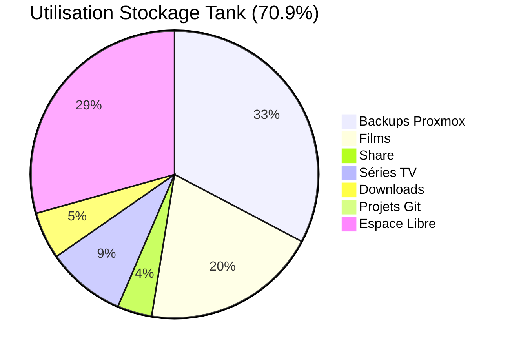
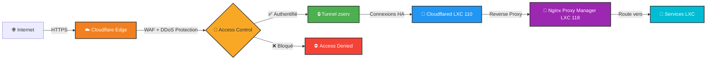
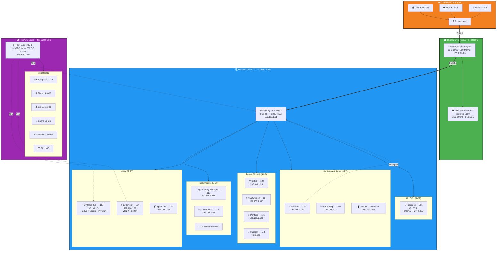

# 🏠 Homelab Infrastructure - Zorko

> Infrastructure auto-hébergée complète avec virtualisation, stockage ZFS, et accès sécurisé via Cloudflare Zero Trust

---

## 📊 Vue d'Ensemble de l'Infrastructure

### Statistiques Actuelles

| Métrique | Valeur | Détails |
|----------|--------|---------|
| **Conteneurs LXC** | 12 actifs + 1 stoppé | Production 24/7 |
| **Machines Virtuelles** | 1 stoppée | debian12-cloudinit (template) |
| **Capacité Stockage** | 932 GB | 661 GB utilisés (70.9%) — 271 GB libres |
| **RAM Proxmox** | 32 GB DDR4 | ~6.4 GB utilisés (19.5%) |
| **CPU Hyperviseur** | AMD Ryzen 5 5600X | 6 cores / 12 threads |
| **Uptime Proxmox** | 9+ jours | PVE 9.1.7 / kernel 6.17.4-2-pve |
| **Freebox Delta** | FW 4.9.18.1 | Uptime: 10 jours — 10 Gbps ↓ / 900 Mbps ↑ |

### Répartition du Stockage TrueNAS (Tank — 661 GB / 932 GB)

---

## 🏗️ Architecture Globale

### Flux de Trafic Internet → Services

### Architecture Infrastructure Complète

---

## 📁 Services Exposés (Nginx Proxy Manager — 17 hôtes)

| Status | Domaine | Backend | SSL |
|--------|---------|---------|-----|
| 🟢 | ad.zorko.xyz | 192.168.1.189:80 | ✅ |
| 🟢 | cockpit.zorko.xyz | 192.168.1.61:9090 | ✅ |
| 🟢 | git.zorko.xyz | 192.168.1.93:3000 | ✅ |
| 🟢 | grafana.zorko.xyz | 192.168.1.194:3000 | ✅ |
| 🟢 | home.zorko.xyz | 192.168.1.13:8581 | ✅ |
| 🟢 | kuma.zorko.xyz | 192.168.1.42:3001 | ✅ |
| 🟢 | nas.zorko.xyz | 192.168.1.109:80 | ✅ |
| 🟢 | npm.zorko.xyz | 192.168.1.186:81 | ✅ |
| 🟢 | petio.zorko.xyz | 192.168.1.51:5055 | ✅ |
| 🟢 | plex.zorko.xyz | 192.168.1.108:32400 | ✅ |
| 🟢 | port.zorko.xyz | 192.168.1.62:9443 | ✅ |
| 🟢 | prow.zorko.xyz | 192.168.1.51:9696 | ✅ |
| 🟢 | pve.zorko.xyz | 192.168.1.61:8006 | ✅ |
| 🟢 | qbit.zorko.xyz | 192.168.1.52:8090 | ✅ |
| 🟢 | radarr.zorko.xyz | 192.168.1.51:7878 | ✅ |
| 🟢 | sonarr.zorko.xyz | 192.168.1.51:8989 | ✅ |
| 🟢 | vault.zorko.xyz | 192.168.1.110:8000 | ✅ |

> DNS wildcard `*.zorko.xyz → 192.168.1.186` géré par AdGuard Home — NPM centralise tous les reverse proxy internes.

---

## 🎯 Points Forts Techniques

### Sécurité
- ✅ **Zero-Trust Access** via Cloudflare Tunnel (aucun port ouvert sur Internet)
- ✅ **AdGuard Home** (VM Freebox) — DNS filtrant avec DNSSEC, 6 listes actives
- ✅ **Vaultwarden** (LXC 114) — admin token argon2id, inscriptions désactivées, backups sqlite3 automatiques
- ✅ **qBittorrent VPN Kill Switch** — iptables OUTPUT DROP + bind tun0 (Windscribe)
- ✅ **Firewall Proxmox** — règles per-node + cluster, accès SSH restreint
- ✅ **WAF Cloudflare** avec protection DDoS intégrée
- ✅ **Reverse Proxy SSL** centralisé (Nginx Proxy Manager)

### Virtualisation & Infrastructure
- ✅ **12 conteneurs LXC** en production 24/7
- ✅ **LXC 201 Inference** — Ollama avec 2× NVIDIA Quadro P5000 (GPU passthrough)
- ✅ **Proxmox VE 9.1.7** sur Debian Trixie (kernel 6.17.4-2-pve)
- ✅ **Monitoring** : Grafana + Uptime Kuma + Cockpit

### Stockage & Données
- ✅ **ZFS RAID 1** (miroir) — 932 GB total, 70.9% utilisé
- ✅ **NFS** pour stockage Proxmox (backups, médias, downloads)
- ✅ **Snapshots ZFS automatiques** — quotidiens, rétention 14 jours
- ✅ **Backups Proxmox vzdump** — hebdomadaires (dim. 01:00), 10 CTs, rétention 2

### Réseau
- ✅ **Freebox Delta** — FTTH 10 Gbps ↓ / 900 Mbps ↑ (FW 4.9.18.1)
- ✅ **DNS AdGuard** avec DNSSEC et 1 077k règles de blocage
- ✅ **Cloudflare DNS** zone zorko.xyz (Free plan)

---

## 📂 Documentation Détaillée

- **[Architecture Réseau](./architecture/network.md)**
- **[Stockage](./architecture/storage.md)**
- **[Virtualisation](./architecture/virtualization.md)**
- **[Compute](./hardware/compute.md)**
- **[Hardware Storage](./hardware/storage.md)**
- **[Hardware Réseau](./hardware/network.md)**
- **[Sécurité](./security/access_control.md)**
- **[Cloudflare Zero Trust](./security/cloudflare_zero_trust.md)**
- **[Backups](./automation/backups.md)**

---

## 🛠️ Technologies Utilisées

**Virtualisation & Conteneurs**
- Proxmox VE 9.1.7 (LXC + QEMU/KVM) sur Debian Trixie
- Docker dans LXC dédié (112)
- Ollama (LXC 201 avec GPU passthrough 2× P5000)

**Stockage**
- TrueNAS Scale — ZFS RAID 1, compression LZ4

**Réseau & Sécurité**
- Cloudflare Zero Trust (Tunnel + DNS + Access)
- AdGuard Home (VM Freebox) — DNS filtrant + DNSSEC
- Nginx Proxy Manager — reverse proxy SSL
- WireGuard VPN (intégré Freebox)
- iptables kill switch VPN (qBittorrent)

**Services Applicatifs**
- Stack Média : Radarr, Sonarr, Prowlarr, qBittorrent, Plex
- Gitea (Git auto-hébergé)
- Vaultwarden (gestionnaire de mots de passe)
- Homebridge (HomeKit)
- Grafana + Uptime Kuma (monitoring)
- AgentDVR (surveillance vidéo)

---

**Dernière mise à jour** : 2026-04-14
**Données récupérées en direct** : APIs Proxmox, TrueNAS, NPM, Cloudflare, Freebox Delta, AdGuard
