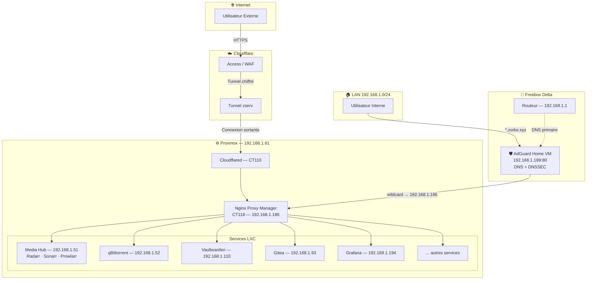

# Architecture Réseau

Topologie réseau du homelab — flux de trafic externes (Cloudflare Zero Trust) et internes (NPM + AdGuard DNS).

## Diagramme des Flux Réseau

## Description des Flux

### Flux Externe (Cloudflare Zero Trust)

1. L'utilisateur accède à `service.zorko.xyz` depuis Internet
2. **Cloudflare Access** vérifie l'authentification (email OTP, session 24h)
3. Le **Tunnel zserv** achemine la requête de façon chiffrée vers **Cloudflared** (CT 110) — aucun port ouvert sur la Freebox
4. **Cloudflared** transmet vers **NPM** qui route vers le service cible

### Flux Interne (LAN → AdGuard → NPM)

1. L'utilisateur sur le LAN accède à `service.zorko.xyz`
2. **AdGuard Home** (DNS Freebox) résout `*.zorko.xyz → 192.168.1.186` (wildcard)
3. **NPM** reçoit la requête, termine le SSL, route vers le service interne
4. Accès direct au service sans passer par Cloudflare

### VPN (accès administration)

- **WireGuard** intégré Freebox — accès complet au réseau 192.168.1.0/24
- Utilisé pour administration Proxmox (port 8006), TrueNAS, SSH

## Tableau de Routage NPM (17 hôtes)

| Domaine | Backend | Accessible depuis |
|---------|---------|-------------------|
| ad.zorko.xyz | 192.168.1.189:80 | LAN only |
| cockpit.zorko.xyz | 192.168.1.61:9090 | LAN only |
| git.zorko.xyz | 192.168.1.93:3000 | LAN + Cloudflare |
| grafana.zorko.xyz | 192.168.1.194:3000 | LAN only |
| home.zorko.xyz | 192.168.1.13:8581 | LAN only |
| kuma.zorko.xyz | 192.168.1.42:3001 | LAN only |
| nas.zorko.xyz | 192.168.1.109:80 | LAN only |
| npm.zorko.xyz | 192.168.1.186:81 | LAN only |
| petio.zorko.xyz | 192.168.1.51:5055 | LAN + Cloudflare |
| plex.zorko.xyz | 192.168.1.108:32400 | LAN + Cloudflare |
| port.zorko.xyz | 192.168.1.62:9443 | LAN only |
| prow.zorko.xyz | 192.168.1.51:9696 | LAN only |
| pve.zorko.xyz | 192.168.1.61:8006 | LAN only |
| qbit.zorko.xyz | 192.168.1.52:8090 | LAN only |
| radarr.zorko.xyz | 192.168.1.51:7878 | LAN only |
| sonarr.zorko.xyz | 192.168.1.51:8989 | LAN only |
| vault.zorko.xyz | 192.168.1.110:8000 | LAN + Cloudflare |

---

**Dernière mise à jour** : 2026-04-14
**Données récupérées via** : NPM API + AdGuard API + Freebox API
