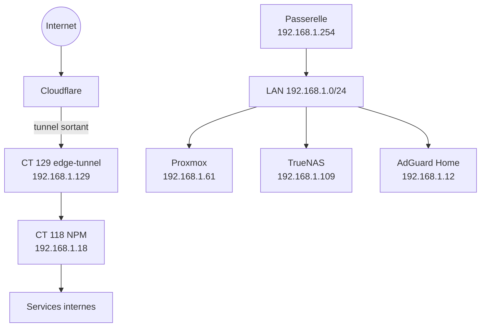

# Architecture réseau

## Topologie actuelle

Le lab utilise un réseau local unique en `192.168.1.0/24`. La passerelle est `192.168.1.254`. L'hôte Proxmox ne possède qu'un bridge de production, `vmbr0`, relié à `eno1`.

## Adresses structurantes

| Rôle | Adresse |
|:---|:---|
| Passerelle LAN | `192.168.1.254` |
| Proxmox VE | `192.168.1.61` |
| TrueNAS | `192.168.1.109` |
| AdGuard Home | `192.168.1.12` |
| Nginx Proxy Manager | `192.168.1.18` |
| Cloudflare Tunnel | `192.168.1.129` |
| Tailscale sur Proxmox | `100.64.185.80` lors de l'audit |

## DNS et exposition web

AdGuard Home assure le DNS filtrant du LAN. Le trafic publié suit le chemin Cloudflare Tunnel → LXC 129 → Nginx Proxy Manager → service cible. NPM comptait 19 proxy hosts actifs sur 24 configurés au moment de l'audit.

## Écart avec l'ancienne architecture

Les VLAN `10.10.10.0/24`, `10.10.20.0/24`, `10.10.30.0/24` et `10.10.40.0/24` décrits auparavant ne sont plus présents sur l'hôte : `bridge vlan show` ne révèle que le VLAN par défaut et tous les LXC utilisent le LAN `192.168.1.0/24`.

Le cloisonnement repose donc aujourd'hui sur les pare-feu, les services d'edge et les contrôles applicatifs, pas sur une séparation L2/L3 par VLAN.
