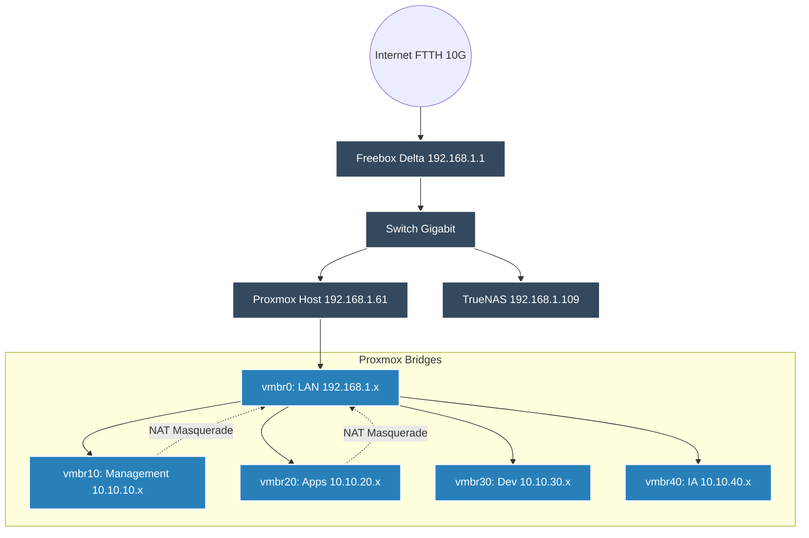

# Architecture Réseau

L'architecture réseau est conçue pour garantir des performances optimales (10G) tout en isolant rigoureusement les environnements via des VLANs.

## Topologie L2 / L3

L'hyperviseur Proxmox gère le routage entre les différents sous-réseaux virtuels.

## Plan d'Adressage (IPAM)

| Sous-réseau | Rôle | Passerelle (Gateway) | Politique Pare-Feu |
|:---|:---|:---|:---|
| **`192.168.1.0/24`** | Réseau Physique (LAN) | `192.168.1.1` (Freebox) | Fait confiance au réseau local |
| **`10.10.10.0/24`** | VLAN 10 : Management | `10.10.10.1` (Proxmox) | Accès aux autres VLANs autorisé |
| **`10.10.20.0/24`** | VLAN 20 : Applications | `10.10.20.1` (Proxmox) | Isolé (Sortie Internet via NAT) |
| **`10.10.30.0/24`** | VLAN 30 : Développement | `10.10.30.1` (Proxmox) | Isolé |
| **`10.10.40.0/24`** | VLAN 40 : IA | `10.10.40.1` (Proxmox) | Isolé |

## Résolution DNS (AdGuard Home)

Toutes les requêtes DNS du réseau local pointent vers une VM AdGuard Home (`192.168.1.189`).
- **Filtrage :** 6 listes actives bloquant traqueurs et publicités (1.07M de règles).
- **DNS Local (Rewrites) :** Le domaine `*.zorko.xyz` est redirigé vers l'IP de Nginx Proxy Manager (`10.10.10.18`), qui se charge du reverse proxying vers le bon VLAN.
