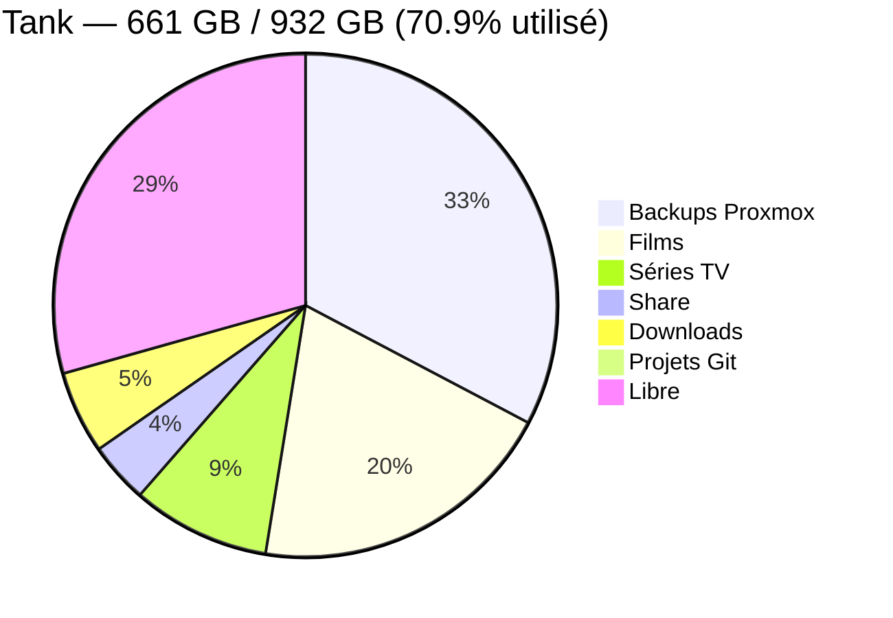

# Architecture de Stockage

Le stockage est centralisé sur TrueNAS Scale avec ZFS RAID 1. Proxmox monte les datasets via NFS pour les sauvegardes, médias et downloads.

## Architecture Globale

```mermaid
graph TD
    subgraph TN["💿 TrueNAS Scale — 192.168.1.109"]
        POOL[Pool 'Tank' — RAID 1 ZFS<br/>932 GB effectifs — 661 GB utilisés]
        
        subgraph MIRROR["Topologie — Miroir ZFS"]
            D1[💾 WD Red 1TB — sda]
            D2[💾 WD Red 1TB — sdb]
        end

        subgraph DS["📁 Datasets"]
            DS_B[backup — 302 GB]
            DS_F[Film — 183 GB]
            DS_S[Series — 82 GB]
            DS_SH[share — 36 GB]
            DS_DL[download — 49 GB]
            DS_G[project/gitea — 2 GB]
        end

        POOL --> DS_B & DS_F & DS_S & DS_SH & DS_DL & DS_G
        POOL --> MIRROR
        MIRROR --> D1 & D2
    end

    subgraph PVE["⚙️ Proxmox VE — 192.168.1.61"]
        subgraph NFS_MNT["Montages NFS"]
            MNT_B[/mnt/pve/Backup]
            MNT_F[/mnt/pve/Film]
            MNT_S[/mnt/pve/Series]
            MNT_DL[/mnt/pve/Download]
            MNT_G[/mnt/pve/gitea]
        end

        CT104[LXC 104 — qBittorrent]
        CT130[LXC 130 — Media Hub]
        VZDUMP[vzdump backups]
    end

    DS_B -.NFS.-> MNT_B
    DS_F -.NFS.-> MNT_F
    DS_S -.NFS.-> MNT_S
    DS_DL -.NFS.-> MNT_DL
    DS_G -.NFS.-> MNT_G

    MNT_F --> CT130
    MNT_S --> CT130
    MNT_DL --> CT104
    MNT_B --> VZDUMP
```

## Répartition Actuelle du Stockage



## Détail des Datasets

| Dataset | Taille | Export NFS | Description |
|---------|--------|------------|-------------|
| Tank/server/backup | 302 GB | `/mnt/pve/Backup` | Sauvegardes vzdump hebdomadaires (10 CTs) |
| Tank/server/Film | 183 GB | `/mnt/pve/Film` | Bibliothèque films (Radarr → Plex) |
| Tank/server/Series | 82 GB | `/mnt/pve/Series` | Bibliothèque séries (Sonarr → Plex) |
| Tank/share | 36 GB | — | Partage fichiers général (SMB/NFS) |
| Tank/server/download | 49 GB | `/mnt/pve/Download` | Téléchargements en cours (qBittorrent) |
| Tank/server/project/gitea | 2 GB | `/mnt/pve/gitea` | Repositories Gitea |

## Stratégie de Stockage

**ZFS RAID 1 (miroir)** — Les deux disques WD Red 1TB sont en miroir. Toute écriture est dupliquée instantanément sur les deux disques. Protection contre la perte d'un disque sans interruption de service.

**Compression LZ4** — Activée sur le pool. Transparente et quasi sans impact sur les performances, elle réduit l'espace occupé par les fichiers texte et les backups compressibles.

**Snapshots automatiques** — Tâches ZFS quotidiennes (00:00), rétention 14 jours sur les datasets critiques (share, project, download, backup).

**NFS pour Proxmox** — Les datasets sont partagés via NFS vers Proxmox. Cela permet à plusieurs LXC d'accéder aux mêmes volumes sans duplication (ex: Radarr écrit dans `/Film`, Plex lit depuis `/Film`).

> ⚠️ **Pas de réplication off-site** : Les données films/séries sont considérées non-critiques (recréables). Les backups Proxmox (302 GB) sont le point le plus vulnérable — une réplication cloud serait l'amélioration prioritaire.

---

**Dernière mise à jour** : 2026-04-14
**Données récupérées via** : API TrueNAS v2.0 + Proxmox storage status
