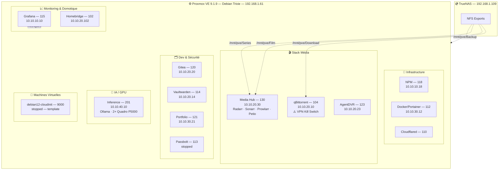

# Architecture de Virtualisation

Ce document présente l'organisation des conteneurs LXC et des machines virtuelles sur l'hyperviseur Proxmox VE 9.1.9.

L'utilisation quasi-exclusive de conteneurs LXC vise à optimiser l'utilisation des ressources — une VM K3s est remplacée par des services conteneurisés plus légers.

## Diagramme de Virtualisation

## Liste Complète des Conteneurs LXC

| CT | Nom | IP | Statut | Rôle détaillé |
|----|-----|----|--------|---------------|
| 102 | homebridge | 10.10.20.102 | 🟢 running | Pont HomeKit — intégration appareils domotique |
| 104 | qbittorrent | 10.10.20.10 | 🟢 running | Client torrent avec VPN Windscribe + kill switch iptables |
| 112 | docker | 10.10.30.12 | 🟢 running | Hôte Docker — géré via Portainer (port 9443) |
| 113 | passbolt | — | 🔴 stopped | Gestionnaire de mots de passe équipe (désactivé) |
| 114 | vaultwarden | 10.10.20.14 | 🟢 running | Bitwarden auto-hébergé — admin token argon2id |
| 115 | grafana | 10.10.10.10 | 🟢 running | Dashboards métriques Proxmox/système |
| 118 | nginxproxymanager | 10.10.10.18 | 🟢 running | Reverse proxy SSL — 31 hôtes proxy actifs |
| 120 | gitea | 10.10.20.20 | 🟢 running | Forge Git auto-hébergée |
| 121 | portfolio | 10.10.30.21 | 🟢 running | Site portfolio personnel |
| 123 | agentdvr | 10.10.20.23 | 🟢 running | Surveillance vidéo (Agent DVR) |
| 130 | media-hub | 10.10.20.30 | 🟢 running | Radarr + Sonarr + Prowlarr + Petio (stack *Arr) |
| 201 | inference | 10.10.40.10 | 🟢 running | Ollama + modèles LLM — GPU passthrough 2× P5000 |

## Stratégie de Virtualisation

**Conteneurs LXC (préféré)** — faible surcharge, isolation par service, démarrage rapide, snapshots LVM-thin. Chaque service dans son propre CT facilite maintenance, mises à jour et sécurité.

**VM QEMU/KVM** — uniquement pour les cas nécessitant un OS complet ou une isolation matérielle (ex. GPU passthrough pour l'inférence AI). Le template `debian12-cloudinit` sert de base pour des déploiements rapides si nécessaire.

**GPU Passthrough** — LXC 201 bénéficie du passthrough des 2× Quadro P5000 pour Ollama. Permet l'exécution locale de modèles LLM (100k tokens contexte sur mythos26b).

**Stack Média consolidée** — Radarr, Sonarr, Prowlarr et Petio sont regroupés dans LXC 130 pour simplifier la gestion et partager les montages NFS.

---

**Dernière mise à jour** : 2026-04-14
**Données récupérées via** : Proxmox API + SSH (`pct list`, `qm list`)
