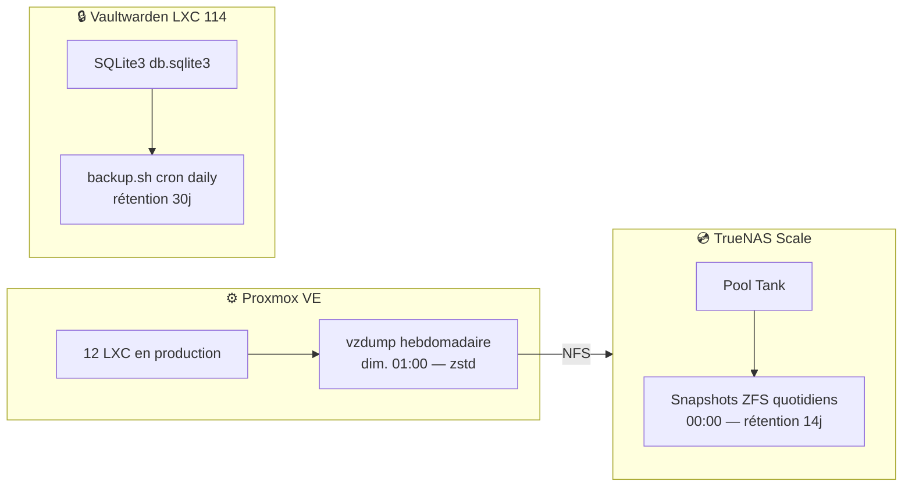

# Automation : Sauvegardes

Stratégie de sauvegarde du homelab — vzdump Proxmox, snapshots ZFS TrueNAS, et backup Vaultwarden.

## Vue d'Ensemble



---

## 1. Sauvegardes Proxmox (vzdump)

Configurées dans `/etc/pve/jobs.cfg` (PVE 9.x).

| Paramètre | Valeur |
|-----------|--------|
| **Fréquence** | Hebdomadaire — dimanche 01:00 |
| **Stockage cible** | `Backup` (NFS → Tank/server/backup — 302 GB) |
| **Compression** | zstd |
| **Rétention** | 2 dernières sauvegardes par CT |
| **Mode** | snapshot (sans interruption) |

### Conteneurs sauvegardés (10)

| CT | Nom | Rôle |
|----|-----|------|
| 102 | homebridge | Domotique HomeKit |
| 104 | qbittorrent | Client torrent |
| 112 | docker | Hôte Docker |
| 114 | vaultwarden | Gestionnaire de mots de passe |
| 115 | grafana | Monitoring |
| 118 | nginxproxymanager | Reverse proxy |
| 120 | gitea | Forge Git |
| 121 | portfolio | Site portfolio |
| 123 | agentdvr | Surveillance vidéo |
| 130 | media-hub | Stack média |

> **LXC 201 (inference/Ollama) exclue** — modèles recréables, pas de données critiques.

---

## 2. Snapshots TrueNAS (ZFS)

Instantanés ZFS pour restauration rapide en cas d'erreur ou corruption.

| Paramètre | Valeur |
|-----------|--------|
| **Fréquence** | Quotidienne — 00:00 |
| **Rétention** | 14 jours |

### Datasets concernés

| Dataset | Récursif | Taille actuelle |
|---------|----------|-----------------|
| Tank/share | non | 36 GB |
| Tank/server/project | oui | 2 GB |
| Tank/server/download | non | 49 GB |
| Tank/server/backup | non | 302 GB |
| Tank/server/Film | non | 183 GB |
| Tank/server/Series | non | 82 GB |

> Pas de réplication off-site configurée. Les données médias (Film/Series) sont considérées non-critiques. Les backups Proxmox (302 GB) sont le point à adresser en priorité pour une réplication externe.

---

## 3. Backup Vaultwarden (SQLite3)

Backup automatique de la base de données Vaultwarden — script dédié.

| Paramètre | Valeur |
|-----------|--------|
| **Script** | `/opt/vaultwarden/backup.sh` |
| **Cron** | Quotidien (00:00) |
| **Méthode** | `sqlite3 .backup` (cohérent, sans lock) |
| **Destination** | `/opt/vaultwarden/backups/db_YYYYMMDD_HHMMSS.sqlite3` |
| **Rétention** | 30 jours |

```bash
# /opt/vaultwarden/backup.sh (LXC 114)
BACKUP_DIR=/opt/vaultwarden/backups
DB=/opt/vaultwarden/data/db.sqlite3
sqlite3 $DB ".backup $BACKUP_DIR/db_$(date +%Y%m%d_%H%M%S).sqlite3"
find $BACKUP_DIR -name "*.sqlite3" -mtime +30 -delete
```

---

## ⚠️ Points d'Amélioration

| Priorité | Amélioration |
|----------|-------------|
| 🔴 CRITIQUE | Réplication des backups Proxmox (302 GB) vers stockage off-site (cloud ou disque externe) |
| 🟡 MOYEN | Alertes email en cas d'échec de sauvegarde |
| 🟢 MINEUR | Snapshot TrueNAS récursif sur tous les datasets |

---

**Dernière mise à jour** : 2026-04-14
**Config source** : `/etc/pve/jobs.cfg` + TrueNAS API + `/opt/vaultwarden/backup.sh`
