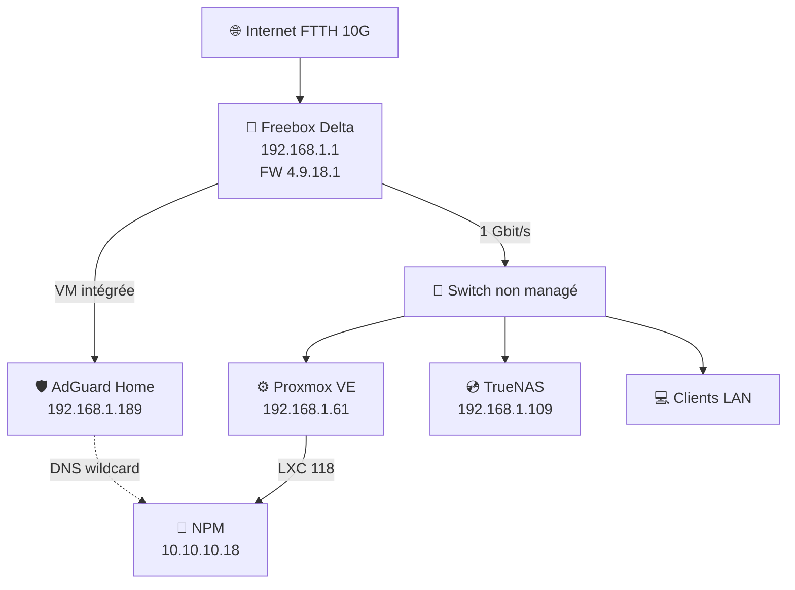

# Matériel : Réseau & Connexion Internet

## Vue d'Ensemble

Infrastructure réseau basée sur une connexion fibre optique FTTH 10 Gbit/s avec Freebox Delta v7.

---

## 🌐 Connexion Internet

### Freebox Delta v7 — Routeur Principal

| Caractéristique | Valeur |
|----------------|--------|
| **Modèle** | Freebox v7 révision 1 (fbxgw7r) |
| **Firmware** | 4.9.18.1 (stable) |
| **Connexion** | FTTH 10 Gbit/s ↓ / 900 Mbit/s ↑ |
| **IP Publique** | [dynamique — Free FTTH] |
| **IPv6** | 2a01:e0a:2b6:2a10::1 /64 |
| **Uptime** | 10+ jours |
| **DNS** | AdGuard Home (VM locale, 192.168.1.189) |

### Capacités & Fonctionnalités

| Fonctionnalité | Statut | Détails |
|----------------|--------|---------|
| **WiFi 6E** | ✅ Actif | Tri-band 2.4/5/6 GHz |
| **Port SFP 10G** | ✅ Disponible | Fibre optique |
| **VM Support** | ✅ Oui | Virtualisation intégrée — héberge AdGuard Home |
| **WireGuard VPN** | ✅ Intégré | Accès réseau local distant |
| **UPnP** | ❌ Désactivé | Sécurité |
| **Port Forwarding** | ❌ Aucun | Zero-Trust via Cloudflare Tunnel |

---

## 🛡️ DNS Filtrant — AdGuard Home (VM Freebox)

| Caractéristique | Valeur |
|----------------|--------|
| **IP** | 192.168.1.189:80 |
| **Version** | v0.107.73 |
| **Listes actives** | 6 (1 077 000+ règles) |
| **DNSSEC** | ✅ Activé |
| **Upstream DNS** | Cloudflare DoH, Google DoH, Quad9 DoH |
| **Stats** | 7 jours de rétention |
| **DNS wildcard** | *.zorko.xyz → 10.10.10.18 (NPM) |

### Listes de Blocage Actives

| Liste | Règles |
|-------|--------|
| AdGuard DNS filter | 165 949 |
| HaGeZi's Ultimate Blocklist | 294 706 |
| Steven Black's List | 87 770 |
| 1Hosts (Lite) | 94 153 |
| privacy-protection-tools anti-AD | 100 958 |
| oisd.nl | 333 119 |

---

## 🔌 Infrastructure Réseau

### Topologie

### Configuration DHCP (Freebox)

| Paramètre | Valeur |
|-----------|--------|
| **Serveur DHCP** | Freebox intégré |
| **Plage** | 192.168.1.10 – 192.168.1.200 |
| **Sous-réseau** | 192.168.1.0/24 |
| **Passerelle** | 192.168.1.1 |
| **DNS primaire** | 192.168.1.189 (AdGuard Home) |

---

## 🛡️ Sécurité Réseau

- **Aucun port ouvert** sur le routeur (pas de port forwarding)
- **Tous les services externes** passent par Cloudflare Tunnel `zserv`
- **WireGuard VPN** intégré Freebox pour accès réseau local distant
- **DNS filtrant** AdGuard Home — DNSSEC activé, DoH upstream
- **Firewall Proxmox** — règles cluster + node (accès 9090 Cockpit LAN only)

### Deux méthodes d'accès distant

| Méthode | Usage | Sécurité |
|---------|-------|----------|
| **Cloudflare Tunnel** | Services web publics (avec auth) | WAF + DDoS + Access |
| **WireGuard VPN** | Administration complète LAN | Chiffrement WireGuard |

---

## 📊 Débits Mesurés

| Direction | Capacité | Utilisation Typique |
|-----------|----------|---------------------|
| **Download** | 10 Gbit/s | 100–600 Mbit/s |
| **Upload** | 900 Mbit/s | 5–50 Mbit/s |

**Latence** : ~5-10ms (vers Paris)

---

## 🔧 Équipements

| Rôle | Matériel | Capacité |
|------|----------|----------|
| Routeur/Box | Freebox Delta v7 | 10G ↓ / 900M ↑ |
| Switch | HPE (192.168.1.77) | Gigabit |
| WiFi Mesh | TP-Link Deco BE25 (×3) | WiFi 7 BE3600 — 2,5G uplink — ~490m² |
| DNS filtrant | VM Freebox (AdGuard) | 1 077k règles |

> ⚠️ **WiFi Freebox désactivé** — entièrement remplacé par le mesh TP-Link Deco BE25 3-pack. Le Deco gère la couverture WiFi 7 sur toute la surface, avec itinérance transparente entre les 3 points d'accès.

---

**Dernière mise à jour** : 2026-04-14
**Données récupérées via** : Freebox API + AdGuard API
