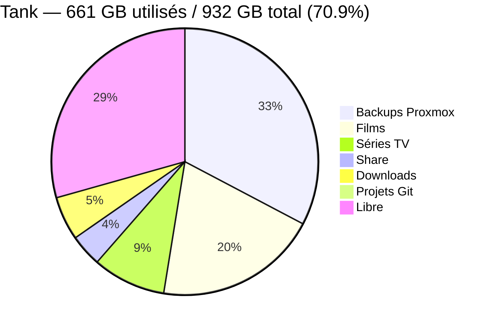

# Matériel : Stockage

Ce document liste le matériel physique utilisé pour le stockage centralisé des données.

## Serveur TrueNAS Scale

| Composant | Modèle / Spécification | Notes |
|-----------|------------------------|-------|
| **CPU** | Intel N100 | 4 cores / 4 threads — jusqu'à 3.4 GHz |
| **RAM** | 16 GB DDR4 | |
| **Châssis** | Mini PC AOOSTAR | Format compact |
| **Stockage OS** | 512 GB NVMe SSD | |
| **IP** | 192.168.1.109 | Interface web port 80 |

## Disques du Pool 'Tank' (RAID 1 / Miroir ZFS)

| Rôle | Modèle | Capacité | Statut |
|------|--------|----------|--------|
| Disk 1 | WD Red | 1 TB | 🟢 ONLINE |
| Disk 2 | WD Red | 1 TB | 🟢 ONLINE |

**Capacité effective** : 932 GB (miroir = 50% de la capacité brute)

## Répartition du Stockage

## Datasets ZFS

| Dataset | Taille | Montage Proxmox | Usage |
|---------|--------|-----------------|-------|
| Tank/server/backup | 302 GB | `/mnt/pve/Backup` | Sauvegardes vzdump |
| Tank/server/Film | 183 GB | `/mnt/pve/Film` | Films Plex/Radarr |
| Tank/server/Series | 82 GB | `/mnt/pve/Series` | Séries Plex/Sonarr |
| Tank/share | 36 GB | `/mnt/pve/Share` | Partage fichiers |
| Tank/server/download | 49 GB | `/mnt/pve/Download` | Torrents qBittorrent |
| Tank/server/project/gitea | 2 GB | `/mnt/pve/gitea` | Repos Gitea |

**Total utilisé** : 661 GB — **Disponible** : 271 GB

---

**Dernière mise à jour** : 2026-04-14
**Données récupérées via** : API TrueNAS v2.0
