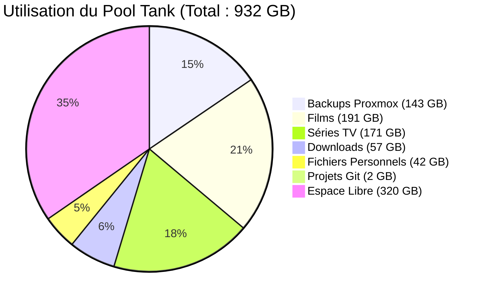

# Matériel : Stockage (NAS)

L'infrastructure s'appuie sur un nœud de stockage physique dédié tournant sous TrueNAS Scale.

## Nœud TrueNAS Scale

| Spécification | Détail |
|:---|:---|
| **CPU** | Intel N100 (4 cœurs / 4 threads, jusqu'à 3.4 GHz) |
| **RAM** | 16 GB DDR4 |
| **Châssis** | Mini PC AOOSTAR (Format Ultra-compact) |
| **Stockage OS** | 512 GB NVMe SSD |
| **Système d'Exploitation** | TrueNAS Scale 26.0.0-BETA.1 |
| **Réseau** | IP: `192.168.1.109` (Interface Admin) |

## Disques Physiques & ZFS

Le stockage de données principal repose sur un système de fichiers ZFS configuré en miroir (RAID 1) pour assurer la redondance et la tolérance aux pannes.

| Rôle | Disque (Modèle) | Capacité Brute | Santé (S.M.A.R.T) |
|:---|:---|:---|:---|
| **Disk 1** | WD Red HDD | 1 TB | ✅ Activé (Tests réguliers) |
| **Disk 2** | WD Red HDD | 1 TB | ✅ Activé (Tests réguliers) |

*Capacité Nette Utilisable du Pool "Tank" :* **932 GB**

## Métriques du Pool (Tank)

*(Mise à jour automatique des quotas via scripts de surveillance ZFS)*
