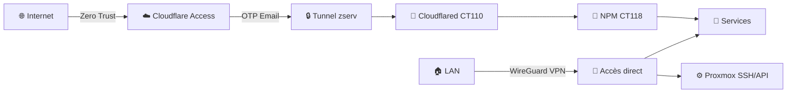

# Sécurité : Contrôle d'Accès

Couches de sécurité du homelab — de l'accès externe aux services internes.

## Vue d'Ensemble



---

## 1. Accès Externe — Cloudflare Zero Trust

Aucun port ouvert sur la Freebox. Tout le trafic externe transite par Cloudflare Tunnel.

| Aspect | Configuration |
|--------|--------------|
| **Tunnel** | `zserv` — 8 connexions simultanées CDG |
| **Auth** | Email OTP — session 24h |
| **WAF** | Actif — DDoS Layer 3/4 automatique |
| **Services protégés** | send.zorko.xyz, pdf.zorko.xyz, vault.zorko.xyz |
| **Wildcard DNS** | *.zorko.xyz → [IP publique] (Cloudflare proxied) |

## 2. DNS Filtrant — AdGuard Home

| Aspect | Configuration |
|--------|--------------|
| **IP** | 192.168.1.189:80 (VM Freebox) |
| **DNSSEC** | ✅ Activé |
| **Upstream** | Cloudflare DoH + Google DoH + Quad9 DoH |
| **Règles** | 1 077 000+ (6 listes consolidées) |
| **Wildcard LAN** | *.zorko.xyz → 10.10.10.18 (NPM) |
| **Stats rétention** | 7 jours |

## 3. Vaultwarden — Gestion Secrets

| Aspect | Configuration |
|--------|--------------|
| **LXC** | 114 — 10.10.20.14 |
| **Admin token** | Argon2id hash (m=65536, t=3, p=4) |
| **Inscriptions** | ❌ Désactivées (`signups_allowed: false`) |
| **Backup** | ✅ Automatique — sqlite3 daily, 30j rétention |
| **Accès admin** | vault.zorko.xyz/admin (LAN + Cloudflare) |

## 4. qBittorrent — VPN Kill Switch

| Aspect | Configuration |
|--------|--------------|
| **LXC** | 104 — 10.10.20.10 |
| **VPN** | Windscribe OpenVPN (tun0) |
| **Kill switch** | iptables OUTPUT DROP — exceptions: lo, established, LAN, udp/tcp 443, tun0 |
| **Binding** | Interface=tun0 (WebUI coupe si VPN down) |
| **Service** | Démarrage conditionné à openvpn-windscribe.service |

```
iptables OUTPUT policy: DROP
  - loopback → ACCEPT
  - established/related → ACCEPT
  - 192.168.1.0/24 → ACCEPT
  - eth0:443 tcp/udp → ACCEPT (négociation VPN)
  - tun0 → ACCEPT (tout le trafic sortant via VPN)
```

## 5. Firewall Proxmox

| Règle | Port | Source | Action |
|-------|------|--------|--------|
| Cockpit Web UI | 9090 | 192.168.1.0/24 | ACCEPT |
| SSH | 22 | LAN | ACCEPT (clé uniquement) |
| PVE Web | 8006 | LAN | ACCEPT |
| WireGuard* | 51820 | — | Supprimée (orpheline) |

> *La règle WireGuard 51820 a été supprimée lors de l'audit — WireGuard est géré par la Freebox, pas Proxmox.

## 6. Accès SSH

| Système | Méthode | Notes |
|---------|---------|-------|
| Proxmox (192.168.1.61) | Clé publique uniquement | root@pam + API token |
| LXC → via `pct exec <id>` | Depuis host Proxmox | Pas de SSH direct aux LXC |
| TrueNAS | API Bearer token | Pas de SSH direct en prod |

## 7. Matrice d'Accès Services

| Service | LAN | Internet | Auth | Port |
|---------|-----|----------|------|------|
| Vaultwarden | ✅ | ✅ CF | Admin token argon2id | 8000 |
| Gitea | ✅ | ✅ CF | Compte utilisateur | 3000 |
| Proxmox | ✅ | ❌ | PVE API token / SSH key | 8006 |
| NPM Admin | ✅ | ❌ | Email + mot de passe | 81 |
| Radarr | ✅ | ❌ | API key (LAN only) | 7878 |
| Sonarr | ✅ | ❌ | API key (LAN only) | 8989 |
| qBittorrent | ✅ | ❌ | Basic auth | 8090 |
| AdGuard | ✅ | ❌ | Session cookie | 80 |
| Grafana | ✅ | ❌ | Auth Grafana | 3000 |
| TrueNAS | ✅ | ❌ | API Bearer token | 80/443 |
| Cockpit | ✅ | ❌ | PAM root | 9090 |

---

**Dernière mise à jour** : 2026-04-14
**Audit réalisé** : 2026-04-14 — Proxmox, NPM, Vaultwarden, qBittorrent, AdGuard
