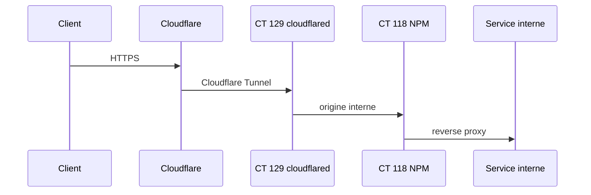

# Cloudflare Tunnel et reverse proxy

## Chemin du trafic

`cloudflared` ne tourne plus sur l'hôte Proxmox ni dans AdGuard. Il est isolé dans le LXC 129 `edge-tunnel`, à l'adresse `192.168.1.129`. Le service systemd y était actif et utilisait cloudflared 2026.8.2 pendant l'audit.

Nginx Proxy Manager tourne dans le LXC 118 à l'adresse `192.168.1.18`. Sa base contenait :

- 24 proxy hosts configurés ;
- 19 proxy hosts actifs ;
- aucun redirection host, dead host ou stream configuré.

## Frontière de confiance

Le tunnel fournit un chemin entrant initié depuis le LAN et évite d'exposer directement chaque application. NPM conserve la terminaison et le routage vers les services internes.

Le terme « Zero Trust » ne doit toutefois pas être appliqué à tout le lab par extension. Les politiques Cloudflare Access n'ont pas été auditées, et le LAN ne possède actuellement pas de segmentation VLAN. La sécurité effective dépend donc aussi des règles Cloudflare, du pare-feu Proxmox, des authentifications applicatives et de la configuration du routeur.
