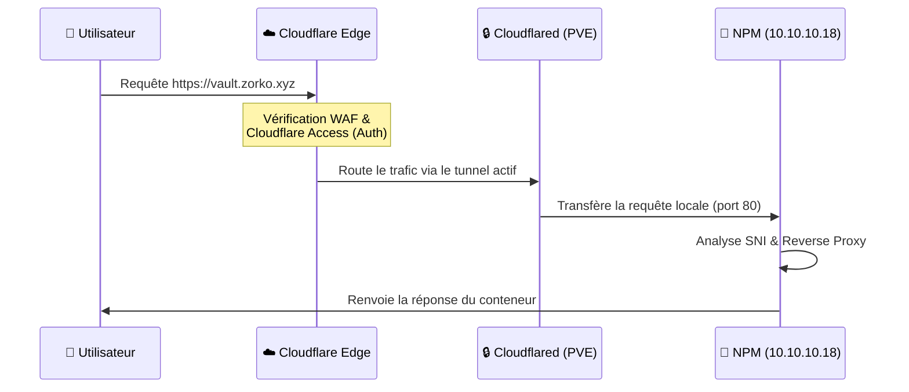

# Cloudflare Zero Trust

L'infrastructure s'appuie sur Cloudflare pour exposer les services de manière ultra-sécurisée, sans ouvrir le moindre port sur la Freebox.

## Principe du Tunnel Cloudflared

Un démon `cloudflared` tourne directement sur l'hôte Proxmox (géré à distance via Token). Il maintient des connexions sortantes (tunnels chiffrés persistants) vers les datacenters de Cloudflare.

## Cloudflare Access (Identity Aware Proxy)

Pour les services critiques (non publics), Cloudflare Access exige une authentification forte (SSO, OTP) **avant** même de router le paquet vers le tunnel.
- Le serveur local ne voit jamais les tentatives de bruteforce, Cloudflare absorbe tout.
- La véritable adresse IP de la maison est masquée.
