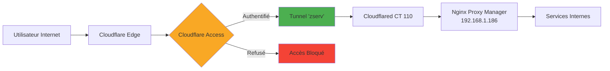

# Cloudflare Zero Trust

## Vue d'Ensemble

Infrastructure sécurisée utilisant Cloudflare Zero Trust pour exposer les services sans ouvrir de ports sur le réseau domestique.

### Métriques Clés

| Métrique | Valeur | Statut |
|----------|--------|--------|
| **Tunnel Principal** | zserv | 🟢 Healthy |
| **Connexions Actives** | 8 simultanées | Haute disponibilité |
| **Services Protégés** | 3 applications Access | Cloudflare Access |
| **DNS Records** | 23 enregistrements | Actifs |
| **Domaine** | zorko.xyz | Actif depuis 2024 |
| **Plan Cloudflare** | Free | Amplement suffisant |

---

## 🔐 Architecture Zero Trust

**Avantages :**
- ✅ **Aucun port ouvert** sur le routeur domestique
- ✅ **WAF intégré** (Web Application Firewall)
- ✅ **Protection DDoS** automatique par Cloudflare
- ✅ **Authentification centralisée** via Cloudflare Access
- ✅ **Chiffrement end-to-end** avec certificats SSL automatiques
- ✅ **Haute disponibilité** avec 8 connexions simultanées

---

## 🌐 Tunnel Cloudflare "zserv"

| Paramètre | Valeur |
|-----------|--------|
| **ID** | `[tunnel-id]` |
| **Type** | `cfd_tunnel` |
| **Statut** | 🟢 Healthy |
| **Créé le** | 26 mars 2024 |
| **Gestion** | Remote config (dashboard Cloudflare) |
| **Hébergé sur** | LXC 110 (Proxmox) |

### Haute Disponibilité — 8 connexions simultanées CDG

| Datacenter | Région | Version Client |
|------------|--------|----------------|
| CDG07 | Paris | 2025.2.0 |
| CDG07 | Paris | 2025.2.0 |
| CDG08 | Paris | 2024.12.2 |
| CDG11 | Paris | 2024.12.2 |
| CDG11 | Paris | 2024.12.2 |
| CDG12 | Paris | 2025.2.0 |
| CDG13 | Paris | 2024.12.2 |
| CDG14 | Paris | 2025.2.0 |

---

## 🔑 Cloudflare Access — Applications Protégées

### 1. Send (send.zorko.xyz)
- **Service** : Partage de fichiers sécurisé
- **Auth** : Email OTP — session 24h
- **Autorisés** : [email], [email]

### 2. Selfhosted Services (pdf.zorko.xyz, omni.zorko.xyz)
- **Auth** : Email OTP — session 24h
- **Policy** : `emaillist`

### 3. Warp Access
- **Endpoint** : zorko.cloudflareaccess.com/warp
- **Auth** : Authentification stricte

---

## 🌍 DNS Configuration (Zone: zorko.xyz)

### Services via Tunnel Cloudflare

| Sous-domaine | Service | Proxied |
|--------------|---------|---------|
| send.zorko.xyz | Send (fichiers) | ✅ |
| pdf.zorko.xyz | Conversion PDF | ✅ |
| omni.zorko.xyz | Dashboard Omni | ✅ |
| eau.zorko.xyz | Service Eau | ✅ |
| petio.zorko.xyz | Requêtes média | ✅ |
| plex.zorko.xyz | Plex Media Server | ✅ |

### Enregistrements Principaux

| Type | Nom | Contenu | Proxied |
|------|-----|---------|---------|
| A | www.zorko.xyz | [IP publique Freebox] | ✅ |
| A | *.zorko.xyz | [IP publique Freebox] | ✅ |
| MX | zorko.xyz | mailserver.purelymail.com | ❌ |
| TXT | zorko.xyz | SPF record | ❌ |

**Total** : 23 enregistrements actifs

---

## 🛡️ Sécurité

| Aspect | Configuration |
|--------|--------------|
| **SSL** | Universal SSL (Let's Encrypt) — renouvellement automatique |
| **TLS** | 1.3 (mode Full Strict) |
| **DDoS** | Protection Layer 3/4 automatique |
| **Bot Protection** | Active |
| **Rate Limiting** | Non configuré |
| **Auth** | Email OTP — 24h session |

---

## 📊 Compte Cloudflare

| Info | Valeur |
|------|--------|
| **Création** | 29 juin 2016 |
| **Type** | Standard (Free) |
| **Account ID** | [account-id] |
| **Tunnels actifs** | 1 (zserv) |
| **Tunnels supprimés** | 9 (tests et migrations) |

---

**Dernière mise à jour** : 2026-04-14
**Données récupérées via** : Cloudflare API
